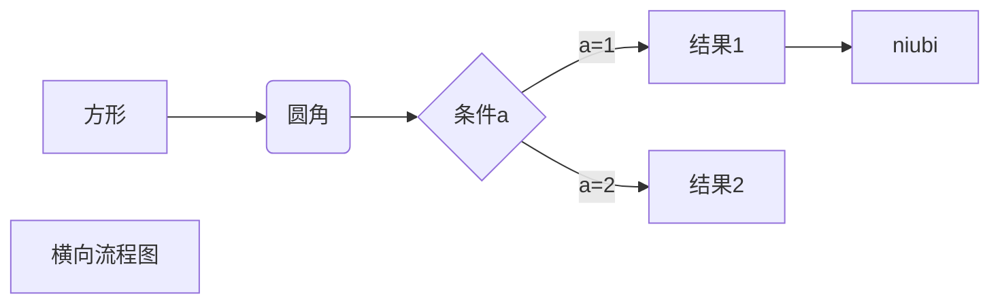
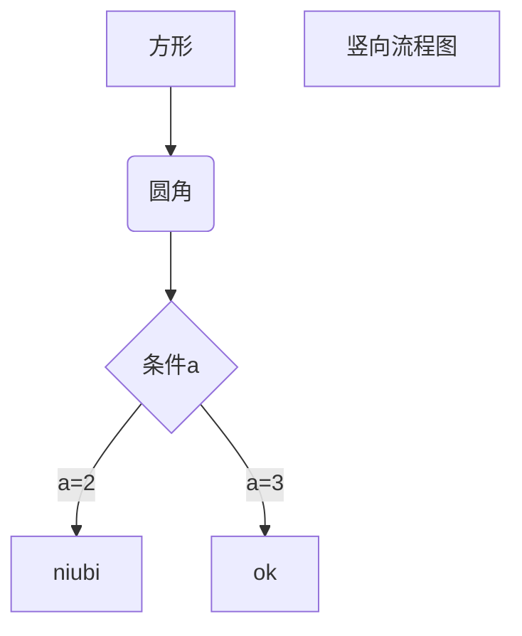

# RUNOOB Markdown Test
## Hello World!
# 一级标题
## 二级标题
### 三级标题
#### 四级标题
##### 五级标题
###### 六级标题

#段落格式
lol  space+space+enter
lol

*斜体文本*  

_斜体文本_  

**粗体文本**  

__粗体文本__  

***粗斜体文本***  

___粗斜体文本___ 

***  
分割线  

~~BAIDU.COM~~ 删减线

<u>带下划线文本</u>

创建脚注格式类似这样 [^3]。

[^3]: 菜鸟教程 -- 学的不仅是技术，更是梦想！！！

创建脚注格式类似这样 [^ok]。

[^ok]: 大。

#列表
* 第一项

+ 第一项

- 第一项

1. 第一项

1. ok:  子列表

    - ok  

#区块
> 最外层
> > 第一层嵌套
> > > 第二层嵌套
> > > >ok

> 区块中使用列表
> 1. 第一项
> 2. 第二项
>>+ 第一项  

* * * * 第一项
    > 菜鸟教程
    > 学的不仅是技术更是梦想
* 第二项

#代码
`print()`函数

    <?php
    echo 'RUNOOB';
    function test(){
        echo 'test'
    }>

```javascript  
$(document).ready(function () {
    alert('RUNOOB');
});
```

#链接
这是一个链接[bibi](https://www.baidu.com)  
<https://www.baidu.com>

这个链接用 1 作为网址变量 [Google][1]
这个链接用 runoob 作为网址变量 [Runoob][runoob]
一个猛男[猛男][2]
然后在文档的结尾为变量赋值（网址）

  [1]: http://www.google.com/
  [runoob]: http://www.runoob.com/
  [2]: https://www.baidu.com

#图片


吃个[mgay][1]

  [1]: https://bkimg.cdn.bcebos.com/pic/359b033b5bb5c9ea58a8cb84d839b6003af3b37a?x-bce-process=image/resize,m_lfit,w_536,limit_1/format,f_jpg


#表格
|mgay|kfc|
|-|-|
|麦乐鸡|原味鸡|
|-|-|

|mgay|kfc|pizzahut|
| :-----| ----: | :----: | 
|麦乐鸡麦乐鸡|原味鸡原味鸡原味|劈叉劈叉劈叉劈叉|

#高级
使用 <kbd>Ctrl</kbd>+<kbd>Alt</kbd>+<kbd>Del</kbd> 重启电脑  
<b>ok</b>
<i>ok</i>

##数学
$$
\begin{Bmatrix}
   a & b \\
   c & d
\end{Bmatrix}
$$
$$
\begin{CD}
   A @>a>> B \\
@VbVV @AAcA \\
   C @= D
\end{CD}
$$




```flow
st=>start: 开始框
op=>operation: 处理框
cond=>condition: 判断框(是或否?)
sub1=>subroutine: 子流程
io=>inputoutput: 输入输出框
e=>end: 结束框
st->op->cond
cond(yes)->io->e
cond(no)->sub1(right)->op
```